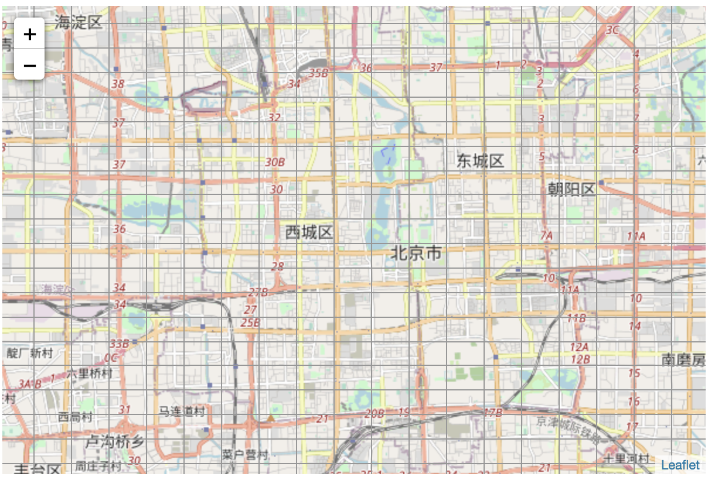

# leaflet.gridline

A leaflet plugin to show grid line according to geohash block

## demo


## Install
```bash
npm i leaflet.gridline
```

## how to use
```js
import 'leaflet.gridline';

// add to map
const gridlineLayer = L.gridlineLayer().addTo(map)

// remove
gridlineLayer.remove();
```